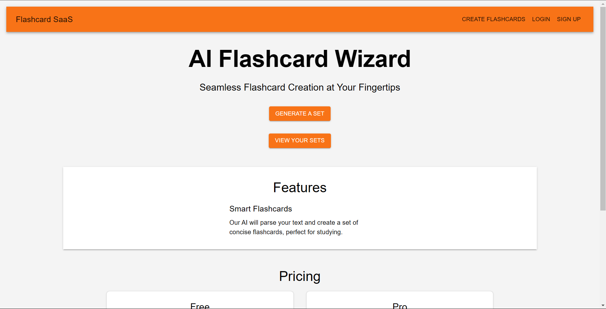

# [Flashcard AI SaaS](https://flashcard-ai-saas.vercel.app/)
[Demo video](https://www.youtube.com/watch?v=h3deLl9D_Ik)





## Overview

Flashcard AI SaaS is a web application designed to help users create, manage, and review flashcards using advanced AI features. The application leverages AI to generate, customize, and analyze flashcards, making studying more efficient and effective.

## Features

- **AI-Powered Flashcards**: Automatically generate flashcards based on user input and AI suggestions.
- **Customizable Flashcards**: Create and modify flashcards with personalized content.
- **Review Modes**: Various review modes including spaced repetition to enhance learning.
- **Analytics**: Track progress and performance with detailed analytics and insights.
- **User Authentication**: Secure login and user management.

## Technologies

- **Frontend**: React, Next.js
- **Backend**: Node.js
- **AI Integration**: OpenAI API
- **Database**: Firebase Datastore
- **Deployment**: Vercel
- **CI/CD**: Vercel
- **Authentication**: Clerk
- **Payment**: Stripe

## Installation

### Prerequisites

- Node.js (>= 14.x)
- npm or yarn

### Setup

1. **Clone the Repository**

   ```bash
   git clone https://github.com/AswinKumar1/flashcard-ai-saas.git
   cd flashcard-ai-saas
   ```

2. **Install Dependencies**

   ```bash
   npm install
   ```

   or

   ```bash
   yarn install
   ```

3. **Configure Environment Variables**

   Create a `.env` file in the root directory and add the following environment variables:

   ```bash
   NEXT_PUBLIC_STRIPE_PUBLIC_KEY=your_public_key
   OPENAI_API_KEY=your_openai_api_key
   STRIPE_SECRET_KEY=your_secret
   ```

4. **Run the Application**

   ```bash
   npm run dev
   ```

   or

   ```bash
   yarn dev
   ```

   The application will be accessible at `http://localhost:3000`.

## Deployment

To deploy the application, follow these steps:

1. **Build the Application**

   ```bash
   npm run build
   ```

   or

   ```bash
   yarn build
   ```

2. **Deploy to Vercel**

   For Vercel, you can directly connect your GitHub repository and configure deployment settings in the Vercel dashboard.


